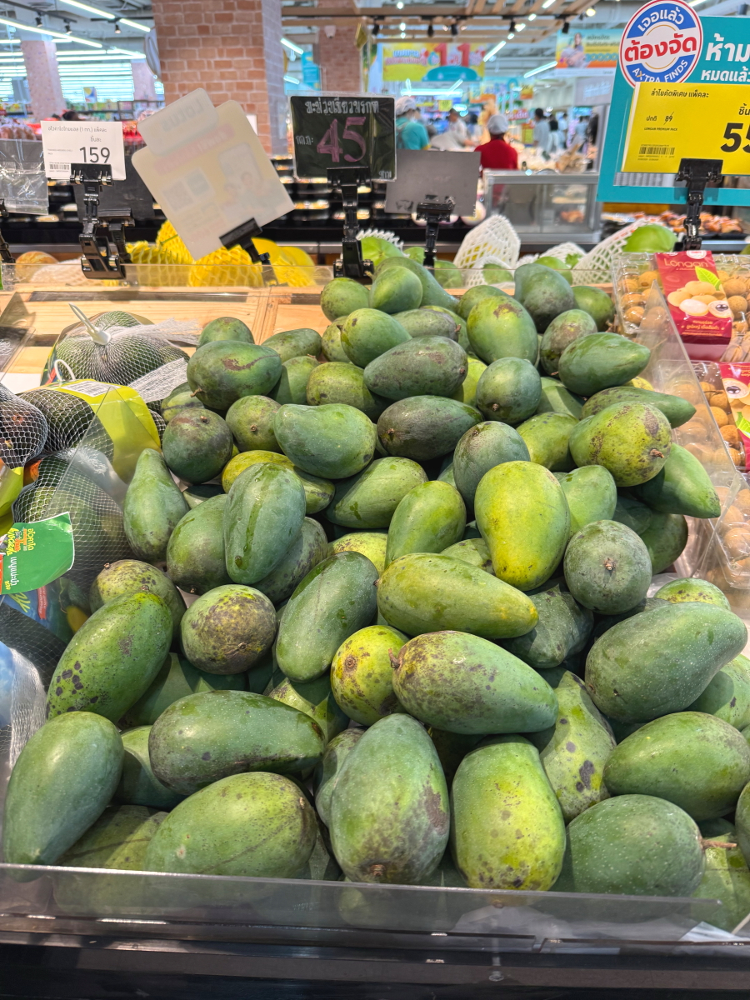

# 20250811_bangkok

<html lang="ja" data-loaded="false" data-scrolled="false" data-spmenu="closed">
<head>

<meta charset="UTF-8">
<meta http-equiv="Content-Type" content="text/html; charset=UTF-8">
<meta http-equiv="X-UA-Compatible" content="IE=EmulateIE10" />
<meta http-equiv="X-UA-Compatible" content="IE=edge">

<meta name="viewport" content="width=device-width, initial-scale=1.0">

<!--ここから上はお決まりの定型文です-->

<!--ここからが表現の書式などを決めるcssという部分-->

<link href="https://cdnjs.cloudflare.com/ajax/libs/lightbox2/2.7.1/css/lightbox.css" rel="stylesheet">

</head>

<body>

モバイル端末をお使いの場合は、画面を横向きにすると
より見やすくご覧頂けます。

<!--ここ上は、ほぼそのまま使います！-->

<!--QRコードの挿入例-->

 アクセス用QRコード

<marquee direction="left" scrollamount="20" width="30%">(^_^)/~alis</marquee>

<!--流れ文字の挿入例-->
<h1><marquee behavior="left">!!! 2025/08/09-10、晴天の住宅街から、巨大ショッピングモールまで!!!</marquee></h1>

                          

<!--ここから下が、本体部分-->
    

 
<h2>9日、熱帯の陽射しが住宅街に降り注ぎます</h2>

    
<h2>後ろのお宅は売り出し中</h2>

    
<h2>熱帯のお花が陽射しを浴びてニッコリ！</h2>

    
<h2>洗車後にビニールでラップされた車</h2>

    
<h2>生垣のお花たちも満開です</h2>

    
<h2>この一帯のセールスオフィス</h2>

<h2>細い路地に入ってローカルな市場に向かいます</h2>

<iframe width="560" height="315" src="https://www.youtube.com/embed/H5gE6v894uo?si=8v380Lj4-kgwHwbi" title="YouTube video player" frameborder="0" allow="accelerometer; autoplay; clipboard-write; encrypted-media; gyroscope; picture-in-picture; web-share" referrerpolicy="strict-origin-when-cross-origin" allowfullscreen></iframe>
    

<h2>市場はタイ人だけで大盛況</h2>

    
<h2>お菓子片手に子供がうろうろ、奥には宝くじ売り場も見えてます</h2>

    
<h2>市場入り口に座り込むお爺ちゃん</h2>

    
<h2>エサ待ちのワンちゃん</h2>

    
<h2>市場の電源</h2>

    
<h2>先ほどのワンちゃん、餌をもらいました</h2>

    
<h2>コンビニに入ると猫が餌をねだります</h2>

    
<h2>コンビニで猫の餌を買って、外であげました</h2>

<h2>住宅街に沈む夕陽</h2>

    
<h2>市場で買ったバナナとドラゴンフルーツ</h2>

    
<h2>10日、住宅街の朝日</h2>

    
<h2>住宅街の空を飛ぶ鳥</h2>

    
<h2>いつもの巨大ショッピングモールに向かいます</h2>

<h2>車を止めた場所は忘れないようにしっかり撮影</h2>

    
<h2>レジのベルトコンベアシステム、前のお客さんの買い物品との境に三角の棒を置いて区切ります</h2>

    
<h2>レジを出たところで募金活動、日本人だとすぐに分かったみたいで日本語での挨拶でした 画像クリックで動画再生します↓</h2>

    
<h2>DONKIもありましたが商品価格はかなり高め、現地の人たちには人気があるようです</h2>

    
<h2>ショッピングモールからの帰り道、幹線道路の交通状況です</h2>

<iframe width="560" height="315" src="https://www.youtube.com/embed/TS3TogKwRws?si=vD398TOgWKwiYLdI" title="YouTube video player" frameborder="0" allow="accelerometer; autoplay; clipboard-write; encrypted-media; gyroscope; picture-in-picture; web-share" referrerpolicy="strict-origin-when-cross-origin" allowfullscreen></iframe>
    

         

<!--  
<h2>再掲【暑中お見舞い（ほたる）】LINEでご挨拶・動画で送る夏のグリーティングカード / ギターbgm/蛍の光・癒し動画</h2>

<iframe width="560" height="315" src="https://www.youtube.com/embed/Z4PKDOhRzfI?si=LaAJ8dA-1izGspEO" title="YouTube video player" frameborder="0" allow="accelerometer; autoplay; clipboard-write; encrypted-media; gyroscope; picture-in-picture; web-share" referrerpolicy="strict-origin-when-cross-origin" allowfullscreen></iframe>
    
   
-->   
    
    

  
<h2>今日のBGMは Chicago Greatest Hits Full Album 2024 - The Best Of Chicago Playlist Of All Time</h2>

<iframe width="560" height="315" src="https://www.youtube.com/embed/fEl_IdF57QI?si=At7QFMXKKC8lOtkd" title="YouTube video player" frameborder="0" allow="accelerometer; autoplay; clipboard-write; encrypted-media; gyroscope; picture-in-picture; web-share" referrerpolicy="strict-origin-when-cross-origin" allowfullscreen></iframe>
    

    
  
<h2>もう一つ、8月10日にメタバースで披露されたまいてゃさんのライブ映像</h2>

<iframe width="560" height="315" src="https://www.youtube.com/embed/9K6bYnxUEgk?si=9IiGoC6GXRRTfA6I" title="YouTube video player" frameborder="0" allow="accelerometer; autoplay; clipboard-write; encrypted-media; gyroscope; picture-in-picture; web-share" referrerpolicy="strict-origin-when-cross-origin" allowfullscreen></iframe>
    

    
    

    
    
    <h3>「雪の中で輝くシンデレラ」by まいてゃ</h3>
<h2><a href="https://torokoid.github.io/20250219_chiangrai/maitiyaz.mp3" target="_blank">この文字クリックで再生します 下の再生ボタンでも同じ曲をループ再生します</a></h2>

    <audio controls loop>
        <source src="https://torokoid.github.io/20250219_chiangrai/maitiyaz.mp3" type="audio/mpeg">
        お使いのブラウザは audio タグをサポートしていません。
    </audio>
 
    
<!--
  
<h2>スティーブ・ジョブズの伝説の講義</h2> 
<iframe width="560" height="315" src="https://www.youtube.com/embed/XsRpvWHIVw0?si=f7IA0pv9iZWVk3VH" title="YouTube video player" frameborder="0" allow="accelerometer; autoplay; clipboard-write; encrypted-media; gyroscope; picture-in-picture; web-share" referrerpolicy="strict-origin-when-cross-origin" allowfullscreen></iframe>    
    
    
<h2>スティーブ・ジョブズ氏の講義の内容が「笑って死ぬ」by まいてゃ さんの歌の内容と大筋で同じに聞こえます 以下に再掲しますね</h2>

    
<h3>歌の後半部分しか撮れてませんが、2月16日のイベントで公開された「笑って死ぬ」 by まいてゃ 白ドレスはダンサーの玖遠さん、黒いドレスがまいてゃさん</h3>
<iframe width="560" height="315" src="https://www.youtube.com/embed/s4ZcbxAluMM?si=Xa32xo19UCNaWv0v" title="YouTube video player" frameborder="0" allow="accelerometer; autoplay; clipboard-write; encrypted-media; gyroscope; picture-in-picture; web-share" referrerpolicy="strict-origin-when-cross-origin" allowfullscreen></iframe> 
-->
    

    <h3>お気に入りの「笑って死ぬ」 by まいてゃさんも再々掲です</h3>
<h2><a href="https://torokoid.github.io/20250221_chiangrai/maitiya3.mp3" target="_blank">この文字クリックで再生します 下の再生ボタンで同じ曲をループ再生します</a></h2>

    <audio controls loop>
        <source src="https://torokoid.github.io/20250221_chiangrai/maitiya3.mp3" type="audio/mpeg">
        お使いのブラウザは audio タグをサポートしていません。
    </audio>

   
<h2>以上、晴天の住宅街から、巨大ショッピングモールまででした。 ここまでご覧いただきありがとうございました。</h2>

     
<h2>
<a href="https://torokoid.github.io/Mashiko_himawari_3/" target="_blank">クリックでメニューページに戻ります</a>
</h2>

   

<!-- hitwebcounter Code START -->
<a href="https://www.hitwebcounter.com" target="_blank">

あなたは 番目の訪問者です 数値は8月1日以降に立ち上げたバンコクシリーズHPの累計です
</a>   

         

  

      

<!--本体はここまで-->

<!--画面に空白地帯を作って、背景が見えるようにしています-->
                                              

<!-- フッタ -->
<footer>

Copyright 2025/08/11 alis @Bangkok

</footer>

<!--HPにさまざまなJavaScriptを呼び込むための書式-->

    
    </body>
    
</html>
